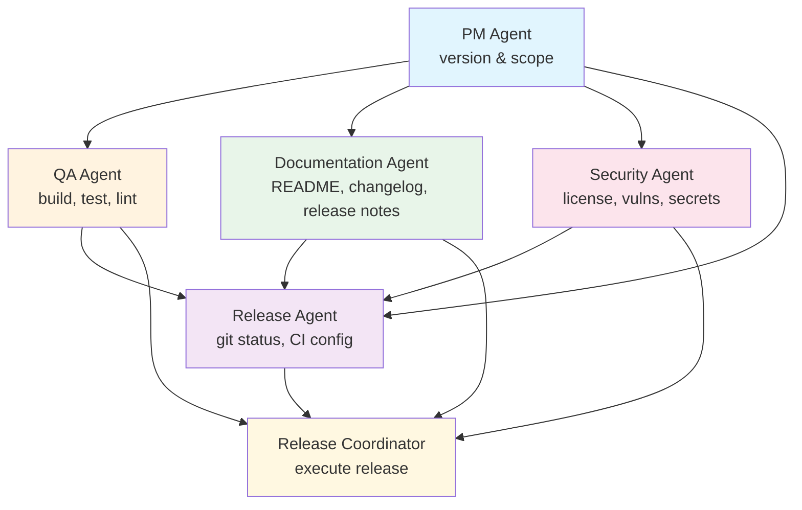

# Release Agent Team

[![Build Status][build-status-svg]][build-status-url]
[![Lint Status][lint-status-svg]][lint-status-url]
[![Go Report Card][goreport-svg]][goreport-url]
[![Docs][docs-godoc-svg]][docs-godoc-url]
[![License][license-svg]][license-url]

**Multi-agent release preparation team for multi-language repositories.**

Release Agent Team validates code quality, generates changelogs, updates documentation, and manages the complete release lifecycle. It supports monorepos with multiple languages and integrates with Claude Code as an interactive subagent.

## Features

- **Auto-detection**: Detects Go, TypeScript, JavaScript, Python, Rust, Swift
- **Validation checks**: Build, test, lint, format, security, documentation checks
- **Monorepo support**: Handles repositories with multiple languages
- **Changelog generation**: Integrates with schangelog for automated changelogs
- **Documentation updates**: Updates README badges and version references
- **Release workflow**: Full release lifecycle with CI verification
- **Interactive mode**: Ask questions and propose fixes for Claude Code integration
- **Multiple output formats**: Human-readable, JSON, and TOON (Token-Oriented Object Notation)
- **Claude Code plugin**: Available as a plugin with commands, skills, and agents

## Agent Workflow

Release Agent Team uses a DAG (Directed Acyclic Graph) workflow with 6 specialized agents:



| Agent | Role | Checks |
|-------|------|--------|
| **PM** | Product Management | Version recommendation, release scope, changelog quality, breaking changes |
| **QA** | Quality Assurance | Build, tests, lint, format, error handling, mod tidy |
| **Documentation** | Documentation | README, PRD, TRD, release notes, CHANGELOG |
| **Security** | Security | LICENSE, vulnerability scan, dependency audit, secret detection |
| **Release** | Release Management | Version availability, git status, CI configuration |
| **Coordinator** | Orchestration | Executes release workflow after all validations pass |

The workflow ensures:

- **PM runs first** - Validates version and scope before other checks
- **QA, Docs, Security run in parallel** - Independent validation after PM approval
- **Release runs after all validations** - Confirms release readiness
- **Coordinator executes last** - Only proceeds when all teams report GO

## Installation

```bash
go install github.com/agentplexus/release-agent-team/cmd/releaseagent@latest
```

### Homebrew

```bash
brew install agentplexus/tap/release-agent-team
```

## Quick Start

```bash
# Run validation checks in current directory
release-agent-team check

# Run comprehensive validation with Go/No-Go report
release-agent-team validate --version=v1.0.0

# Execute full release workflow
release-agent-team release v1.0.0

# Generate changelog
release-agent-team changelog --since=v0.9.0

# Show version
release-agent-team version
```

## Commands

### `release-agent-team check`

Run validation checks for all detected languages.

```bash
release-agent-team check [directory]

# With options
release-agent-team check --verbose
release-agent-team check --no-test --no-lint
release-agent-team check --coverage
release-agent-team check --go-no-go  # NASA-style Go/No-Go report
```

### `release-agent-team validate`

Run comprehensive validation across all areas (QA, Documentation, Release, Security).

```bash
release-agent-team validate [directory]

# With version-specific checks
release-agent-team validate --version=v1.0.0

# Skip specific areas
release-agent-team validate --skip-qa --skip-docs --skip-security

# Team status report format (template-based)
release-agent-team validate --format team
```

### `release-agent-team release`

Execute the full release workflow.

```bash
release-agent-team release <version>

# Examples
release-agent-team release v1.0.0
release-agent-team release v1.0.0 --dry-run      # Preview without changes
release-agent-team release v1.0.0 --skip-ci      # Don't wait for CI
release-agent-team release v1.0.0 --verbose
```

**Release workflow steps:**

1. Validate version format and availability
2. Check working directory is clean
3. Run validation checks (build, test, lint, format)
4. Generate changelog via schangelog
5. Update roadmap via sroadmap
6. Create release commit
7. Push to remote
8. Wait for CI to pass
9. Create and push release tag

### `release-agent-team changelog`

Generate or update changelog using schangelog.

```bash
release-agent-team changelog [directory]
release-agent-team changelog --since=v0.9.0
release-agent-team changelog --dry-run
```

### `release-agent-team readme`

Update README badges and version references.

```bash
release-agent-team readme [directory]
release-agent-team readme --version=v1.0.0
release-agent-team readme --dry-run
```

### `release-agent-team roadmap`

Update roadmap using sroadmap.

```bash
release-agent-team roadmap [directory]
release-agent-team roadmap --dry-run
```

### `release-agent-team version`

Show version information.

```bash
release-agent-team version
```

## Global Flags

| Flag | Short | Description |
|------|-------|-------------|
| `--verbose` | `-v` | Show detailed output |
| `--interactive` | `-i` | Enable interactive mode |
| `--json` | | Output as structured data |
| `--format` | | Output format: `toon`, `json`, or `team` (validate only) |

## Supported Languages

| Language | Detection | Checks |
|----------|-----------|--------|
| **Go** | `go.mod` | `go build`, `go mod tidy`, `gofmt`, `golangci-lint`, `go test`, local replace, untracked refs, error handling |
| **TypeScript** | `package.json` + `tsconfig.json` | `eslint`, `prettier`, `tsc --noEmit`, `npm test` |
| **JavaScript** | `package.json` | `eslint`, `prettier`, `npm test` |
| **Python** | `pyproject.toml`, `setup.py`, `requirements.txt` | Coming soon |
| **Rust** | `Cargo.toml` | Coming soon |
| **Swift** | `Package.swift` | Coming soon |

### Go Checks Detail

| Check | Type | Description |
|-------|------|-------------|
| no local replace | Hard | Fails if go.mod has local replace directives |
| mod tidy | Hard | Fails if go.mod/go.sum need updating |
| build | Hard | Fails if project doesn't compile |
| gofmt | Hard | Fails if code isn't formatted |
| golangci-lint | Hard | Fails if linter reports issues |
| tests | Hard | Fails if tests fail |
| error handling | Hard | Fails if errors are improperly discarded |
| untracked refs | Soft | Warns if tracked files reference untracked files |
| coverage | Soft | Reports coverage (requires `gocoverbadge`) |

### Validation Areas

The `validate` command checks four distinct areas:

| Area | Checks |
|------|--------|
| **QA** | Build, tests, lint, format, error handling compliance |
| **Documentation** | README, PRD, TRD, release notes, CHANGELOG |
| **Release** | Version validation, git status, CI configuration |
| **Security** | LICENSE file, vulnerability scan, dependency audit, secret detection |

## Configuration

Create `.releaseagent.yaml` in your repository root:

```yaml
# Global settings
verbose: false

# Language-specific settings
languages:
  go:
    enabled: true
    test: true
    lint: true
    format: true
    coverage: false
    exclude_coverage: "cmd"  # directories to exclude from coverage

  typescript:
    enabled: true
    paths: ["frontend/"]  # specific paths (empty = auto-detect)
    test: true
    lint: true
    format: true

  javascript:
    enabled: false  # disable for this repo
```

### Configuration Options

| Option | Type | Default | Description |
|--------|------|---------|-------------|
| `enabled` | bool | `true` | Enable/disable language checks |
| `paths` | []string | auto | Specific paths to check |
| `test` | bool | `true` | Run tests |
| `lint` | bool | `true` | Run linter |
| `format` | bool | `true` | Check formatting |
| `coverage` | bool | `false` | Show coverage (Go only) |

## Git Hook Integration

To run release-agent-team automatically before every `git push`:

```bash
# Create the hook
cat > .git/hooks/pre-push << 'EOF'
#!/bin/bash
exec release-agent-team check
EOF

# Make it executable
chmod +x .git/hooks/pre-push
```

**Bypassing the hook:**

```bash
git push --no-verify
```

## Output Formats

### Human-Readable (Default)

```
=== Summary ===
✓ Go: no local replace directives
✓ Go: mod tidy
✓ Go: build
✓ Go: gofmt
✓ Go: golangci-lint
✓ Go: tests

Passed: 6, Failed: 0, Skipped: 0
```

### JSON (`--json --format=json`)

Standard JSON output for programmatic consumption.

### TOON (`--json --format=toon`)

Token-Oriented Object Notation - approximately 8x more token-efficient than JSON, optimized for LLM consumption.

### Team Status Report (`--format team`)

Structured box report with per-team validation results:

```
╔════════════════════════════════════════════════════════════════════════════╗
║                             TEAM STATUS REPORT                             ║
╠════════════════════════════════════════════════════════════════════════════╣
║ Project: github.com/agentplexus/release-agent-team                         ║
║ Target:  v0.3.0                                                            ║
╠════════════════════════════════════════════════════════════════════════════╣
║ RELEASE VALIDATION                                                         ║
╠════════════════════════════════════════════════════════════════════════════╣
║ qa-validation (qa)                                                         ║
║   build                    🟢 GO                                           ║
║   tests                    🟢 GO    42 tests passed                        ║
║   lint                     🟢 GO                                           ║
╠════════════════════════════════════════════════════════════════════════════╣
║ security-validation (security)                                             ║
║   license                  🟢 GO    MIT License                            ║
║   vulnerability-scan       🟡 WARN  1 deprecated                           ║
╠════════════════════════════════════════════════════════════════════════════╣
║                         🚀 TEAM: GO for v0.3.0 🚀                          ║
╚════════════════════════════════════════════════════════════════════════════╝
```

## Claude Code Plugin

Install as a Claude Code plugin for interactive release automation:

```bash
claude plugin add github:agentplexus/release-agent-team/plugins/claude
```

The plugin includes:

- **Commands**: `/release-agent:release`, `/release-agent:check`, `/release-agent:changelog`, `/release-agent:version-next`
- **Skills**: Version analysis, commit classification
- **Agents**: Release coordinator subagent for orchestrating complete releases

See [plugins/claude/README.md](plugins/claude/README.md) for full plugin documentation.

### Interactive Mode

Use `--interactive` flag to enable Q&A mode where Release Agent can:

- Ask questions when issues arise
- Propose fixes for lint errors
- Get user approval before making changes

```bash
release-agent-team check --interactive
release-agent-team release v1.0.0 --interactive
```

## Examples

### Go Project

```
$ release-agent-team check
=== Pre-push Checks ===

Detecting languages...
  Found: go in .

Running Go checks...

=== Summary ===
✓ Go: no local replace directives
✓ Go: mod tidy
✓ Go: build
✓ Go: gofmt
✓ Go: golangci-lint
✓ Go: tests
✓ Go: untracked references

Passed: 7, Failed: 0, Skipped: 0

All pre-push checks passed!
```

### Comprehensive Validation

```
$ release-agent-team validate --version=v1.0.0

=== Release Validation: v1.0.0 ===

┌─────────────────────────────────────────┐
│            VALIDATION REPORT            │
├─────────────────────────────────────────┤
│ QA             │ 🟢 GO                  │
│ Documentation  │ 🟢 GO                  │
│ Release        │ 🟢 GO                  │
│ Security       │ 🟢 GO                  │
├─────────────────────────────────────────┤
│ STATUS: GO FOR LAUNCH                   │
└─────────────────────────────────────────┘
```

### Full Release

```
$ release-agent-team release v1.0.0 --verbose

[1/9] Validating version...
      ✓ Version v1.0.0 is valid and available

[2/9] Checking working directory...
      ✓ Working directory is clean

[3/9] Running validation checks...
      ✓ All checks passed

[4/9] Generating changelog...
      ✓ CHANGELOG.md updated

[5/9] Updating roadmap...
      ✓ ROADMAP.md updated

[6/9] Creating release commit...
      ✓ Created commit: chore(release): v1.0.0

[7/9] Pushing to remote...
      ✓ Pushed to origin/main

[8/9] Waiting for CI...
      ✓ CI passed

[9/9] Creating tag...
      ✓ Created and pushed tag v1.0.0

Release v1.0.0 complete!
```

## Dependencies

### Required

| Tool | Purpose |
|------|---------|
| `git` | Version control operations |
| `gh` | GitHub CLI for CI status |

### Language-Specific

| Tool | Language | Purpose |
|------|----------|---------|
| `go` | Go | Build and test |
| `golangci-lint` | Go | Linting |
| `node`, `npm` | TypeScript/JS | Build and test |
| `eslint` | TypeScript/JS | Linting |
| `prettier` | TypeScript/JS | Formatting |

### Optional

| Tool | Purpose |
|------|---------|
| `schangelog` | Changelog generation |
| `sroadmap` | Roadmap management |
| `gocoverbadge` | Coverage badge generation |
| `govulncheck` | Vulnerability scanning |

## Documentation

- [PRD.md](PRD.md) - Product requirements
- [TRD.md](TRD.md) - Technical requirements
- [ROADMAP.md](ROADMAP.md) - Development roadmap
- [CHANGELOG.md](CHANGELOG.md) - Release history

## Related Tools

- [schangelog](https://github.com/grokify/structured-changelog) - Structured changelog management
- [sroadmap](https://github.com/grokify/structured-roadmap) - Structured roadmap management
- [gocoverbadge](https://github.com/grokify/gocoverbadge) - Generate coverage badges

## License

MIT License - see [LICENSE](LICENSE) for details.

 [build-status-svg]: https://github.com/agentplexus/release-agent-team/actions/workflows/ci.yaml/badge.svg?branch=main
 [build-status-url]: https://github.com/agentplexus/release-agent-team/actions/workflows/ci.yaml
 [lint-status-svg]: https://github.com/agentplexus/release-agent-team/actions/workflows/lint.yaml/badge.svg?branch=main
 [lint-status-url]: https://github.com/agentplexus/release-agent-team/actions/workflows/lint.yaml
 [goreport-svg]: https://goreportcard.com/badge/github.com/agentplexus/release-agent-team
 [goreport-url]: https://goreportcard.com/report/github.com/agentplexus/release-agent-team
 [docs-godoc-svg]: https://pkg.go.dev/badge/github.com/agentplexus/release-agent-team
 [docs-godoc-url]: https://pkg.go.dev/github.com/agentplexus/release-agent-team
 [license-svg]: https://img.shields.io/badge/license-MIT-blue.svg
 [license-url]: https://github.com/agentplexus/release-agent-team/blob/master/LICENSE
